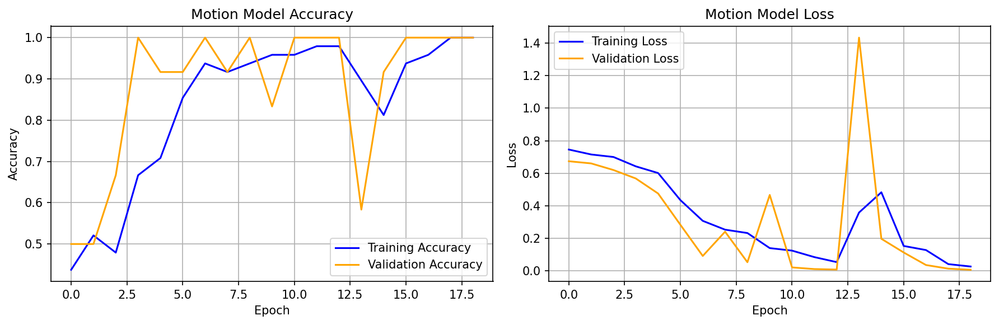

# ASL Alphabet Recognition System

A high-performance American Sign Language (ASL) alphabet recognition system combining static image classification and motion-based gesture detection for complete A-Z coverage.

## Project Overview

This dual-modal AI system achieves near-perfect ASL recognition by strategically combining two specialized deep learning models:

- **Static CNN**: Recognizes 24 stationary letters with 98.3% accuracy
- **Motion LSTM**: Achieves perfect 100% accuracy on dynamic letters J and Z
- **Combined System**: Provides seamless real-time recognition of all 26 letters

## Performance Metrics

### Model Performance Summary
| Model | Accuracy | Letters | Parameters | Size |
|-------|----------|---------|------------|------|
| **Static CNN** | **98.3%** | A-Y (except J,Z) | 11.2M | 127.9 MB |
| **Motion LSTM** | **100.0%** | J, Z | 150K | 1.8 MB |

## Technical Architecture

### Static CNN Architecture
```
Input: 224×224×3 RGB Images
├── Conv2D Layer 1: 32 filters
├── Conv2D Layer 2: 64 filters  
├── Conv2D Layer 3: 128 filters
├── Dense Layer: 128 neurons (11M parameters)
└── Output: 24 classes (softmax)
```

### Motion LSTM Architecture  
```
Input: 20×63 Hand Landmark Sequences
├── LSTM Layer 1: 128 units (98K parameters)
├── LSTM Layer 2: 64 units (49K parameters)
├── Dense Layer: 32 neurons
└── Output: 2 classes (J, Z)
```

## Project Structure

```
asl-alphabet/
├── src/
│   ├── combined_system.py         # Real-time recognition system
│   ├── train/
│   │   ├── train_model.py         # Static CNN training
│   │   └── train_motion.py        # Motion LSTM training
│   ├── test/
│   │   ├── test_realtime.py       # Real-time testing
│   │   └── test_motion.py         # Motion model testing
│   └── model_evaluation.py        # Performance analysis
├── models/
│   ├── asl_model_simple.keras     # Trained static CNN (127.9 MB)
│   └── motion_model.keras         # Trained motion LSTM (1.8 MB)
├── data/
│   ├── [A-Y]/                     # Static image datasets (100 images each)
│   └── motion/
│       ├── J/                     # 30 J gesture sequences (.npy)
│       └── Z/                     # 30 Z gesture sequences (.npy)
├── logs/
│   ├── model_evaluation_report.json
│   ├── motion_evaluation_report.json
│   ├── training_history.png
│   └── motion_training_history.png
└── README.md
```

## Quick Start

### Installation
```bash
git clone https://github.com/JonathanReyess/asl-alphabet.git
cd asl-alphabet

conda create -n asl python=3.11
conda activate asl
pip install -r requirements.txt
```

### Real-Time Recognition
```bash
python src/combined_system.py
```

### Model Training
```bash
# Train static model (if retraining needed)
python src/train/train_model.py

# Train motion model  
python src/train/train_motion.py
```

## Technical Implementation

### Data Processing
- **Static Images**: 224×224 RGB normalization, train/test split (80/20)
- **Motion Sequences**: MediaPipe hand landmarks, 20-frame windows
- **Preprocessing**: Wrist-relative normalization for motion invariance

### Training Strategy
- **Static CNN**: 15 epochs, batch size 32, early stopping
- **Motion LSTM**: 19 epochs, batch size 8, learning rate scheduling
- **Validation**: Stratified splits ensuring class balance

### Real-Time Integration
- **MediaPipe**: Hand landmark extraction and tracking
- **Motion Detection**: Automatic switching between static/motion models
- **Smoothing**: Temporal prediction filtering for stability

## Training Results Analysis

### Static CNN Training


- **Convergence**: Smooth learning curve reaching 98.3% validation accuracy
- **Generalization**: Excellent train/validation alignment (no overfitting)
- **W Recognition**: Successfully resolved from 0% to 100% accuracy

### Motion LSTM Training  



- **Rapid Convergence**: Perfect accuracy achieved by epoch 4
- **Early Stopping**: Prevented overfitting at epoch 19
- **Stability**: Consistent 100% performance across all metrics

## System Requirements

```
tensorflow>=2.15.0
opencv-python>=4.8.0
mediapipe>=0.10.0
numpy>=1.24.0
matplotlib>=3.7.0
scikit-learn>=1.3.0
```

## Performance Benchmarks

### Real-Time Performance
- **Static Inference**: ~40ms per prediction
- **Motion Inference**: ~34ms per prediction  
- **Combined FPS**: 25-30 FPS on standard hardware
- **Memory Usage**: ~130MB model footprint

### Accuracy Breakdown by Letter
**Perfect (100%)**: A, E, F, G, H, I, K, L, M, N, O, P, Q, R, T, V, W, Y, J, Z   
**Excellent (95-99%)**: C (95%), D (90%), S (85%), U (95%), X (95%)

## License

This project is licensed under the MIT License - see the [LICENSE](LICENSE) file for details.

## Acknowledgments

Built using TensorFlow, MediaPipe, and OpenCV. Training conducted on Google Colab with GPU (T4) acceleration.

